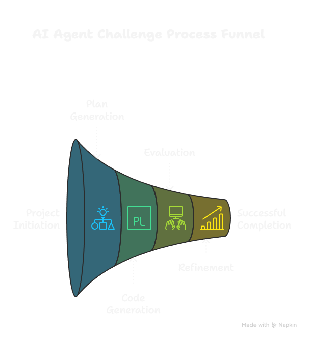
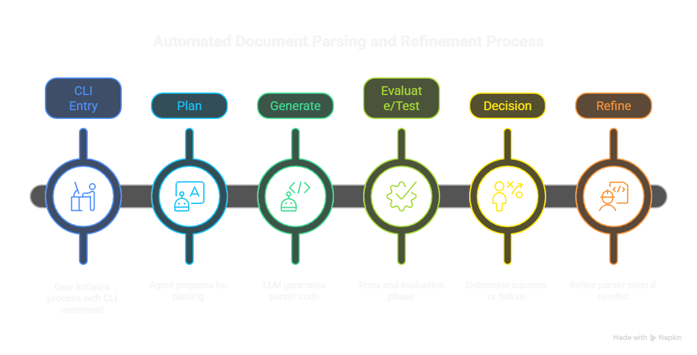

# ai-agent-challenge
Coding agent that generates custom parsers for bank statement PDFs and evaluates them automatically.

## Quickstart (5 steps)

1) Clone and enter the project
- PowerShell:
  - `git clone https://github.com/<your-username>/ai-agent-challenge.git`
  - `cd ai-agent-challenge`

2) Create a virtual environment and install dependencies
- `py -3 -m venv .venv`
- `.\.venv\Scripts\Activate.ps1`
- `pip install -r requirements.txt`

3) Configure API keys
- Create a `.env` file in the project root with:
  - `GOOGLE_API_KEY=your_google_api_key`
  - (optional) `LANGCHAIN_API_KEY=your_langchain_key`

4) Add a sample statement PDF
- Create a folder for your bank and place a PDF:
  - Example: `data\sbi\sbi.pdf`
- Optional: if you already have a reference CSV, place it as `data\sbi\result.csv`. If not, the agent will auto-create a baseline CSV from the PDF.

5) Run the agent
- New bank (auto-baseline + built-in evaluation): `python agent.py --target sbi`
- ICICI reference (runs pytest if available): `python agent.py --target icici`
- Outputs:
  - Generated parser: `custom_parsers\<bank>_parser.py`
  - Expected CSV (auto-created if missing): `data\<bank>\result.csv`
  - Logs show evaluation status; re-run with more refinement attempts if needed:
    - `python agent.py --target sbi --max-attempts 5`

